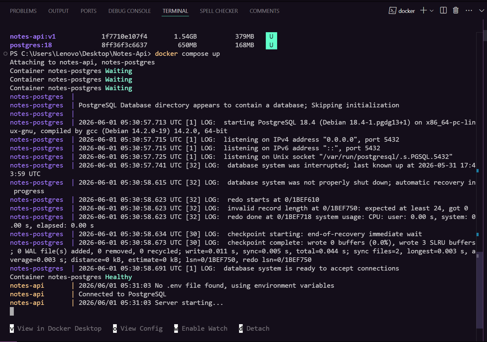
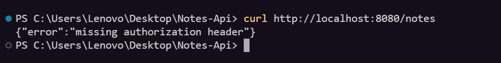

# Notes API


A RESTful Notes API built with **Go**, **PostgreSQL**, and **JWT Authentication** following a layered backend architecture.

This project was built to learn and implement real-world backend development concepts including authentication, authorization, database design, middleware, pagination, migrations, and clean architecture patterns.

---
## Quick Start

```bash
git clone https://github.com/shantam-sharma/Notes-Api.git
cd Notes-Api
docker compose up
API Available At:
```
```text
http://localhost:8080
```
---
## Features

### Authentication

* User Signup
* User Login
* Password Hashing with bcrypt
* JWT Token Generation
* Protected Routes using Middleware

### Notes Management

* Create Note
* Get All Notes
* Get Note By ID
* Update Note
* Delete Note

### Authorization

* Users can only access their own notes
* Ownership validation on all note operations

### Database

* PostgreSQL
* Foreign Key Relationships
* Cascading Deletes
* Database Migrations

### Additional Features

* Pagination
* Structured JSON Responses
* Layered Architecture
* Environment Variable Configuration
* Docker Containerization
* CI/CD with GitHub Actions
* Docker Hub Image Publishing
* Terraform Infrastructure as Code Example

---

## Tech Stack

| Technology     | Purpose                |
| -------------- | ---------------------- |
| Go             | Backend Language       |
| PostgreSQL     | Database               |
| Chi Router     | HTTP Routing           |
| JWT            | Authentication         |
| bcrypt         | Password Hashing       |
| golang-migrate | Database Migrations    |
| godotenv       | Environment Management |
| Docker         | Containerization       |
| Docker Compose | Service Orchestration  |
| Terraform      | Infrastructure as Code |
| Docker Hub     | Container Registry     |
| GitHub Actions | CI/CD Automation       |

---

## Architecture

```text
Client
   │
   ▼
Handlers
   │
   ▼
Services
   │
   ▼
Repositories
   │
   ▼
PostgreSQL
```
## Infrastructure Architecture
```
Developer
    │
    ▼
GitHub Repository
    │
    ▼
GitHub Actions
    │
    ▼
Docker Build
    │
    ▼
Docker Hub
```
---
### Layer Responsibilities

#### Handlers

Responsible for:

* Parsing requests
* Returning responses
* HTTP status codes

#### Services

Responsible for:

* Business logic
* Validation
* Authentication logic

#### Repositories

Responsible for:

* Database queries
* PostgreSQL interaction

---

## Project Structure

```text
Notes-Api/
│
├── cmd/
│   └── main.go
│
├── docs/
│   └── screenshots/
|
├── internal/
│   ├── database/
│   ├── handlers/
│   ├── middleware/
│   ├── models/
│   ├── repositories/
│   ├── services/
│   └── utils/
│
├── migrations/
|
├── terraform/
│   ├── main.tf
│   ├── variables.tf
│   ├── outputs.tf
│   └── README.md
|
├── Dockerfile
├── docker-compose.yml
├── .dockerignore
│
├── .env
├── go.mod
└── README.md
```

---

## Database Schema

### Users Table

```sql
CREATE TABLE users (
    id SERIAL PRIMARY KEY,
    name VARCHAR(255) NOT NULL,
    email VARCHAR(255) UNIQUE NOT NULL,
    password_hash TEXT NOT NULL,
    created_at TIMESTAMP DEFAULT CURRENT_TIMESTAMP
);
```

### Notes Table

```sql
CREATE TABLE notes (
    id SERIAL PRIMARY KEY,
    user_id INTEGER NOT NULL,
    title VARCHAR(255) NOT NULL,
    content TEXT NOT NULL,
    created_at TIMESTAMP DEFAULT CURRENT_TIMESTAMP,
    updated_at TIMESTAMP DEFAULT CURRENT_TIMESTAMP,

    CONSTRAINT fk_user
        FOREIGN KEY(user_id)
        REFERENCES users(id)
        ON DELETE CASCADE
);
```

---

## API Endpoints

### Authentication

| Method | Endpoint | Description   |
| ------ | -------- | ------------- |
| POST   | /signup  | Register User |
| POST   | /login   | Login User    |

---

### Notes

| Method | Endpoint    | Description    |
| ------ | ----------- | -------------- |
| POST   | /notes      | Create Note    |
| GET    | /notes      | Get User Notes |
| GET    | /notes/{id} | Get Note By ID |
| PUT    | /notes/{id} | Update Note    |
| DELETE | /notes/{id} | Delete Note    |

---

## Pagination

Retrieve notes with pagination.

```http
GET /notes?page=1&limit=10
```

### Query Parameters

| Parameter | Description    |
| --------- | -------------- |
| page      | Page Number    |
| limit     | Notes Per Page |

---

## Environment Variables

Create a `.env` file:

```env
DATABASE_URL=<postgres-connection-string>
JWT_SECRET=<jwt-secret>
```

---

## DevOps & Infrastructure

This repository also includes DevOps and Infrastructure as Code examples built while extending the Notes API project.

### Containerization

- Docker
- Docker Compose
- Multi-stage Docker Builds
- PostgreSQL Container

## CI/CD Pipeline

The project includes a GitHub Actions workflow that:

- Builds the application
- Runs tests
- Validates Docker builds
- Publishes Docker images to Docker Hub

Workflow File:

.github/workflows/ci.yml

### Docker Image

Docker Hub Repository:

https://hub.docker.com/r/aayushshantam/notes-api
---
### Terraform

The repository contains Infrastructure as Code examples using Terraform.

Concepts demonstrated:

- Providers
- Resources
- Variables
- Outputs
- State Management

Terraform Commands:

```bash
cd terraform

terraform init
terraform plan
terraform apply
terraform destroy
```
## Running Locally

### Clone Repository

```bash
git clone https://github.com/shantam-sharma/Notes-Api.git
cd Notes-Api
```

### Install Dependencies

```bash
go mod tidy
```

### Configure Environment

Create a `.env` file and add:

```env
DATABASE_URL=<postgres-connection-string>
JWT_SECRET=<jwt-secret>
```

### Run Application

```bash
go run cmd/main.go
```

Server starts on:

```text
http://localhost:8080
```

---

## Sample Login Response

```json
{
  "token": "<jwt-token>"
}
```

---

## Sample Error Response

```json
{
  "error": "unauthorized"
}
```

---

## Concepts Learned

This project demonstrates:

* REST API Design
* Layered Architecture
* Repository Pattern
* JWT Authentication
* Authorization
* Middleware
* PostgreSQL Integration
* Database Migrations
* Pagination
* Error Handling
* Environment Configuration

---
## Docker Deployment

### Build Image

```bash
docker build -t notes-api:multistage .
```

### Run With Docker Compose

```bash
docker compose up
```

### Stop Containers

```bash
docker compose down
```

### Rebuild Containers

```bash
docker compose build --no-cache
docker compose up
```

### Services

| Service    | Port |
| ---------- | ---- |
| Notes API  | 8080 |
| PostgreSQL | 5433 |

### Docker Architecture

```text
Client
   │
   ▼
Notes API Container
   │
   ▼
PostgreSQL Container
```

### Docker Features

* Multi-stage Docker build
* PostgreSQL container
* Docker Compose orchestration
* Persistent database volumes
* Health checks
* Container networking

---
## Screenshots

### Running Containers



### API Endpoint Test



---

## Releases

### v1.0.0

* JWT Authentication
* CRUD Notes API
* Pagination
* Database Migrations
* Layered Architecture

### v1.1.0 — Dockerized Deployment

* Docker Containerization
* Multi-stage Docker Build
* Docker Compose
* PostgreSQL Container
* Health Checks
* Persistent Volumes


